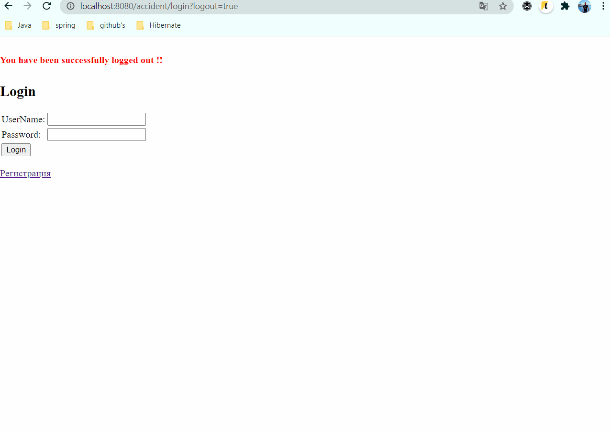
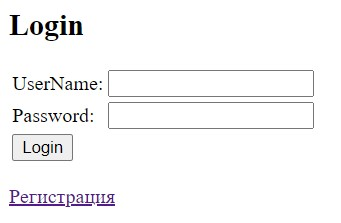
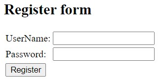
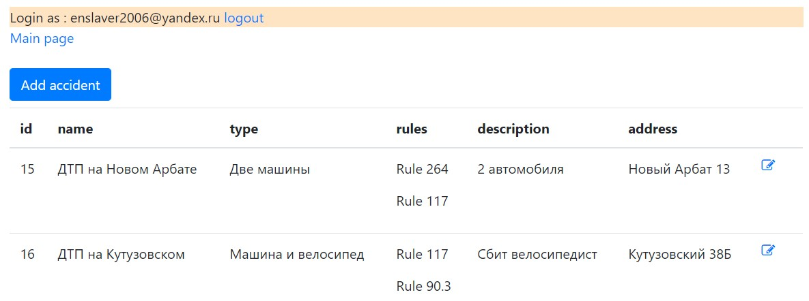
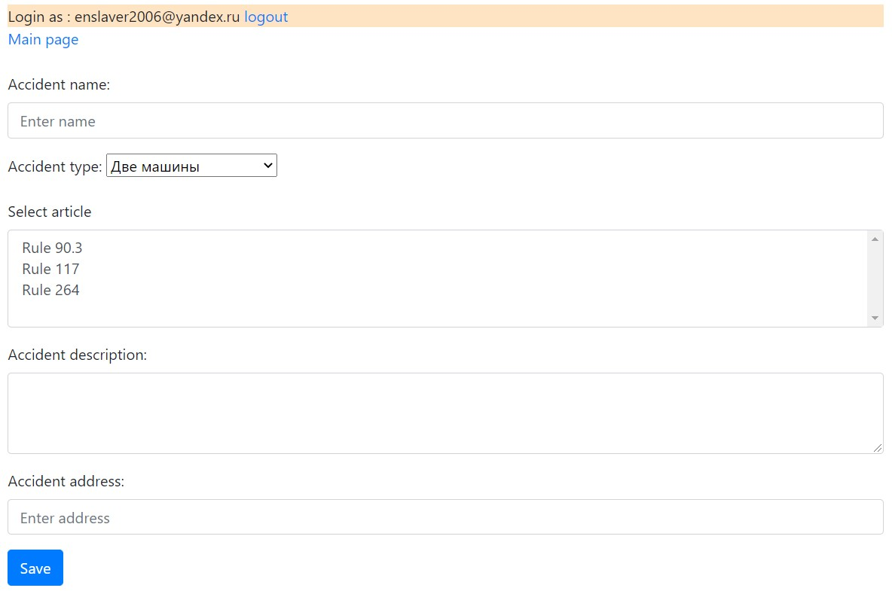
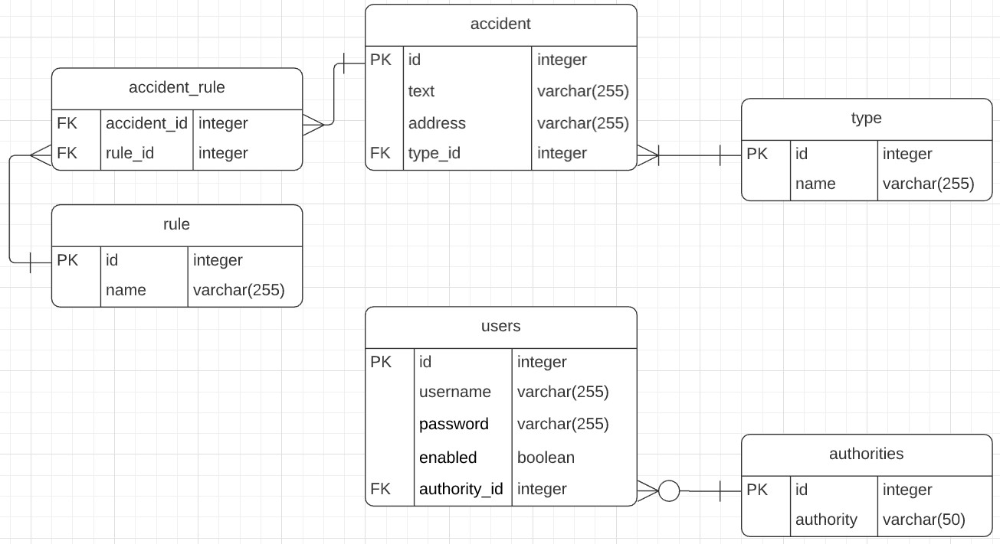

### Car accidents

### О проекте
Площадка для фиксации автомобильных правонарушений. Построено на jsp+bootstrap, Spring
. Позволяет пользователям фиксировать ДТП. Правонарушения сохраняются в БД.
### Technologies
* Java 14
* Java EE Servlets
* Apache Tomcat
* Spring (MVC, Data, Security)
* Postgres
* jsp, Bootstrap (front)
* Maven as a build system
* Travis CI
### Возможности
* Авторизация/регистрация. Доступ только у авторизованных пользователей (реализовано через Spring
 Security).
* Добавление записей. Параметры выбираются из справочников.
* Редактирование записей.
### Demo
Working demo

Login page

Sign Up page

Accidents list

Creating page

Data base schema
